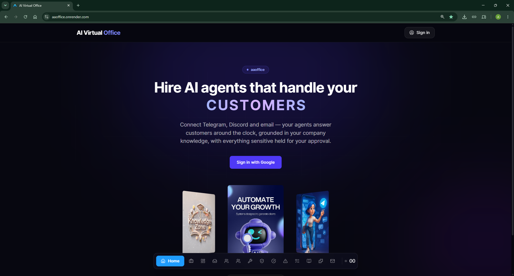
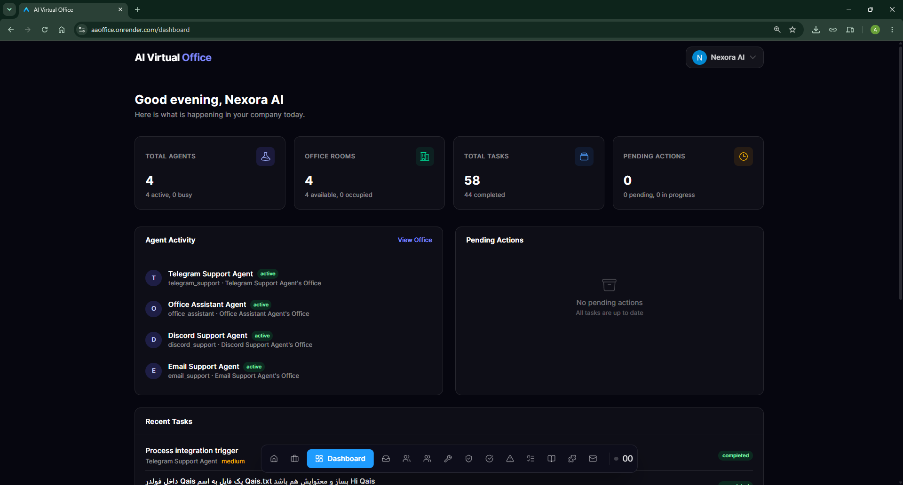
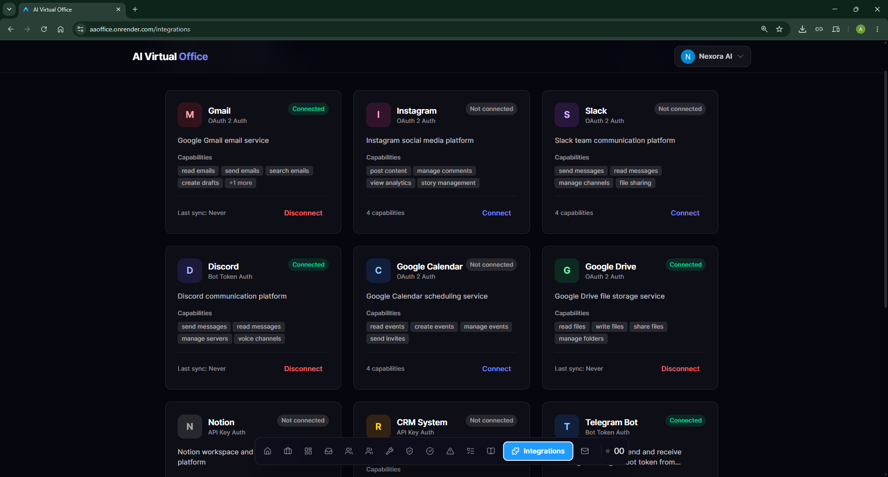
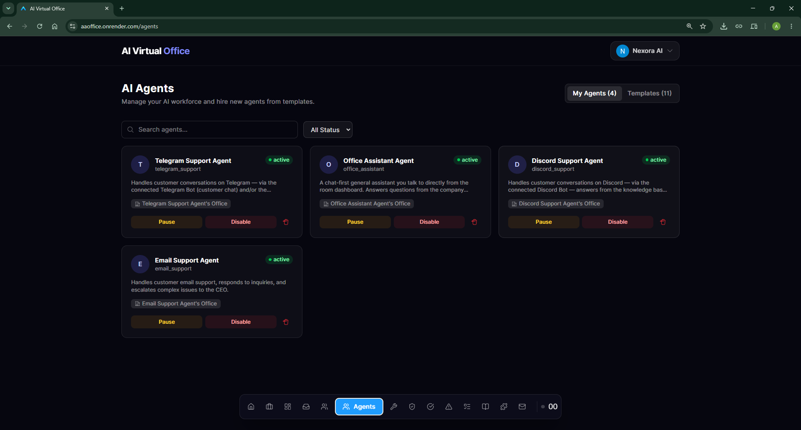
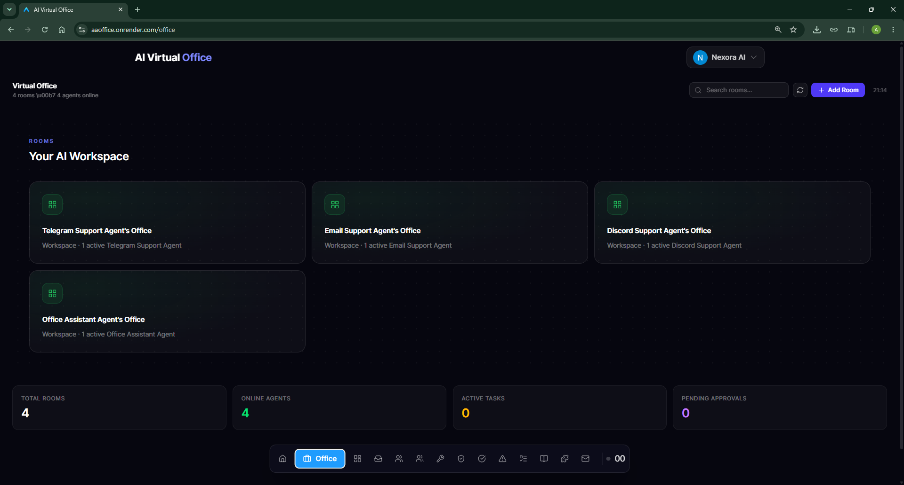
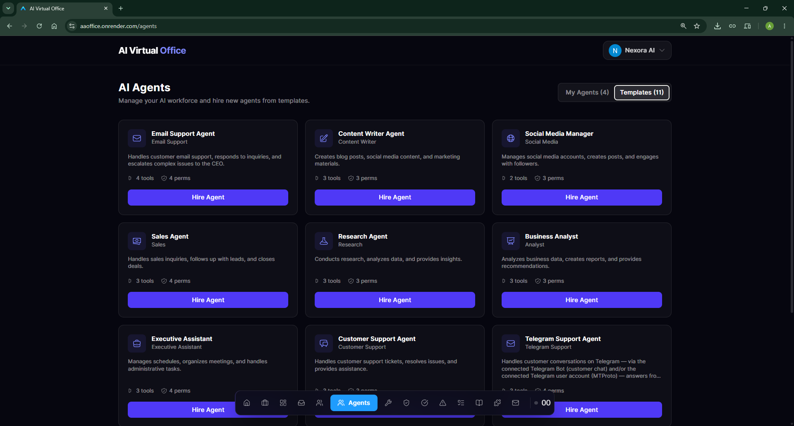
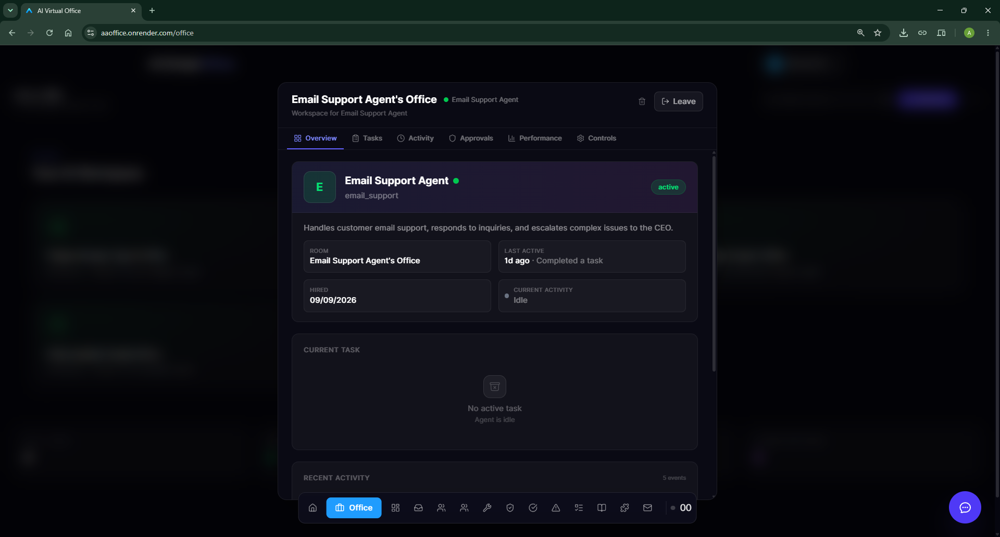

# AI Virtual Office Platform

A self-hosted platform where you hire AI agents into virtual office rooms, connect them to your communication channels (Telegram, Discord, Email/Gmail), and let them work for you around the clock — answering customers, managing files, and grounding every answer in your company knowledge base.

---

## Overview

**AI Virtual Office Platform** turns AI agents into employees. Instead of a one-off chatbot, each agent:

- Lives in an **office room** with a dashboard showing its live activity, current task, and performance
- **Listens to real channels** — inbound Telegram messages, Discord mentions, Gmail/IMAP emails, and scheduled jobs are picked up by background monitors and turned into triggers
- **Reasons and acts** — every trigger goes through a pipeline: RAG retrieval from your knowledge base → LLM decision → tool execution (send a reply, read/write Google Drive, search knowledge) with a full security pipeline (permissions, risk rules, approval flow, audit log)
- **Reports to the CEO** — replies classified as automated, high-risk actions, and sensitive sends are held for CEO approval in the CEO Inbox

The result: a customer messages your Telegram bot at 3 AM, and an agent that knows your company greets them, answers from your actual documentation, and escalates anything sensitive — while you watch it happen in the office dashboard.

## Features

- 🏢 **Virtual office** — create rooms, hire agents from templates (Email Support, Telegram Support, Discord Support, Office Assistant, and more), and watch them work in real time
- 💬 **Multi-channel agents** — inbound monitors for **Telegram (Bot API + MTProto account)**, **Discord (Bot)**, **Gmail (REST + Pub/Sub push)**, and **IMAP/SMTP email accounts**
- 🧠 **RAG knowledge base** — upload company knowledge (text sources), get pgvector-backed semantic search with per-agent access control and source citations injected into every agent decision
- 🗂️ **Google Drive tools** — agents can list/search files, create files and folders (by name — folders are auto-resolved/created), and share them
- 💬 **CEO chat** — talk to any agent directly from the room dashboard (floating chat); agents answer in your language and call tools on demand
- ✅ **Approval workflow** — risk levels per tool action, CEO approval queue, approval history
- 📊 **Dashboards** — agent overview, activity timeline, performance metrics, company analytics, CEO inbox with aggregated counts
- 🔐 **Security** — Fernet-encrypted integration credentials, JWT auth via Google Sign-In, per-agent permissions, rate limiting, audit logging
- ⚡ **Real-time UI** — WebSocket-driven live updates across all dashboard tabs

## Technologies

**Backend** (`backend/`, Python 3.12)

| Tech | Purpose |
|---|---|
| [FastAPI](https://fastapi.tiangolo.com/) 0.115 + Uvicorn (uvloop) | REST API + ASGI server |
| SQLAlchemy 2.0 + Alembic | ORM + migrations (PostgreSQL 16) |
| PostgreSQL + [pgvector](https://github.com/pgvector/pgvector) | Relational data + vector similarity search |
| httpx | Async HTTP for all channel monitors (long polling) |
| [Telethon](https://docs.telethon.dev/) 1.36 | Telegram MTProto (personal account) |
| python-jose, cryptography | JWT auth, Fernet credential encryption |
| LangChain / LangGraph (core, OpenAI, community) + FAISS | LLM orchestration |
| pytest | Test suite (39 test files) |

**Frontend** (`frontend/`, Node 20)

| Tech | Purpose |
|---|---|
| React 19 + TypeScript | UI |
| Vite 8 | Dev server + build |
| Tailwind CSS 4 | Styling |
| Three.js + @react-three/fiber + drei | 3D office visuals |
| Zustand | State (auth + realtime) |
| react-router-dom 7 | Routing |
| motion | Animations |
| Nginx (Docker) | Production static hosting + API proxy |

## Project Structure

```
AI Office/
├── docker-compose.yml          # Full stack: postgres + backend + frontend
├── .env.example                # Root env template (Docker deployment)
│
├── backend/
│   ├── app/
│   │   ├── main.py             # FastAPI app, lifespan: migrations, seeding, schedulers, runtime
│   │   ├── core/               # Config (pydantic-settings), logging, LLM factory, risk levels
│   │   ├── models/             # 36 SQLAlchemy models (agents, triggers, knowledge, sync states…)
│   │   ├── api/v1/endpoints/   # 30 REST routers (agents, triggers, knowledge, approvals…)
│   │   ├── services/           # 38 services — the heart of the system:
│   │   │   ├── agent_runtime.py          # Per-agent loops that claim & process triggers
│   │   │   ├── telegram_bot_monitor_service.py
│   │   │   ├── telegram_monitor_service.py
│   │   │   ├── discord_bot_monitor_service.py
│   │   │   ├── gmail_monitor_service.py / imap_service.py / smtp_service.py
│   │   │   ├── rag_service.py / knowledge_service.py / vector_store.py
│   │   │   ├── tool_execution_service.py # Security pipeline (11 validation steps + reply guard)
│   │   │   ├── trigger_service.py / scheduler.py
│   │   │   ├── hiring_service.py         # Templates → hired agents
│   │   │   └── integration_providers/    # gmail, telegram (bot+account), discord,
│   │   │                                 # google_drive, google_calendar, slack, instagram
│   │   ├── events/             # In-process event bus: publishers, trigger handlers
│   │   ├── middleware/         # Rate limiting, request ID, HTTP logging
│   │   └── database/           # Session/engine, retry helpers
│   ├── alembic/                # 7 migrations (initial schema: 27 tables, pgvector…)
│   ├── tests/                  # 39 test files
│   └── requirements.txt
│
└── frontend/
    ├── src/
    │   ├── pages/              # 19 pages (Office, Agents, Knowledge, CEO, Integrations…)
    │   ├── components/office/  # Room dashboard, agent cards, floating agent chat (FAB)
    │   ├── services/           # API client, WebSocket, office service
    │   ├── stores/             # Zustand stores (auth, realtime)
    │   └── layouts/
    ├── Dockerfile              # node:20 build → nginx:alpine serve
    └── package.json
```

## Installation

### Option A — Docker (full stack)

```bash
# 1. Clone and configure
git clone <repository-url>
cd "AI Office"
cp .env.example .env
# Edit .env and set at minimum:
#   POSTGRES_PASSWORD, SECRET_KEY, ENCRYPTION_KEY, LLM_API_KEY
```

Generate the keys:

```bash
python -c "import secrets; print(secrets.token_urlsafe(64))"          # SECRET_KEY
python -c "from cryptography.fernet import Fernet; print(Fernet.generate_key().decode())"  # ENCRYPTION_KEY
```

```bash
# 2. Build and start everything (postgres :5432, backend :8000, frontend :80)
docker compose up -d --build
```

On startup the backend runs Alembic migrations, seeds templates/integrations/tools/permissions, and starts all channel monitors and the agent runtime automatically.

### Option B — Manual development setup

**PostgreSQL with pgvector is required** (e.g. local install with the extension, or the `pgvector/pgvector:pg16` image used by `docker-compose.yml`).

```bash
# Backend
cd backend
python -m venv venv
venv\Scripts\activate            # Windows  (source venv/bin/activate on Linux/macOS)
pip install -r requirements.txt
cp .env.example .env             # then edit DATABASE_URL + keys
alembic upgrade head             # migrations (also auto-run at startup)
uvicorn app.main:app --reload --port 8000
```

```bash
# Frontend (second terminal)
cd frontend
npm install
cp .env.example .env             # set VITE_API_PROXY_TARGET=http://localhost:8000
npm run dev                      # http://localhost:5173 (proxies /api → backend, ws included)
```

Other frontend scripts: `npm run build` (type-check + production build), `npm run lint` (oxlint), `npm run preview`.

Run the backend test suite:

```bash
cd backend
pytest
```

## Configuration

All configuration is via environment variables (`.env` files are git-ignored). Never commit real keys.

### Root (Docker deployment) — see `.env.example`

| Variable | Description |
|---|---|
| `POSTGRES_USER` / `POSTGRES_PASSWORD` / `POSTGRES_DB` / `POSTGRES_PORT` | Database credentials and port |
| `SECRET_KEY` | JWT signing key — **required in production** |
| `ENCRYPTION_KEY` | Fernet key encrypting integration credentials — **required in production** |
| `FRONTEND_URL` / `FRONTEND_PORT` / `BACKEND_PORT` | Service URLs/ports |
| `BACKEND_CORS_ORIGINS` | JSON array of allowed CORS origins |
| `LLM_PROVIDER` / `LLM_BASE_URL` / `LLM_MODEL` | OpenAI-compatible LLM endpoint (any provider works, e.g. OpenRouter) |
| `LLM_API_KEY` | LLM API key — **required** |
| `EMBEDDING_API_KEY` | Embedding provider key (defaults to `LLM_API_KEY`) |
| `GOOGLE_CLIENT_ID` / `GOOGLE_CLIENT_SECRET` / `GOOGLE_OAUTH_REDIRECT_URI` | Google OAuth (Sign-In + Gmail/Drive/Calendar integrations) |
| `RATE_LIMIT_PER_MINUTE` | API rate limit per client |

### Frontend — see `frontend/.env.example`

| Variable | Description |
|---|---|
| `VITE_API_URL` | Backend API base URL (unset = same-origin `/api/v1` via proxy) |
| `VITE_API_PROXY_TARGET` | Dev proxy target (e.g. `http://localhost:8000`) |
| `VITE_GOOGLE_CLIENT_ID` | Google OAuth client for Sign-In |

### Channel integrations (configured in the UI after deployment)

| Channel | What you need |
|---|---|
| Telegram Bot | Bot token from [@BotFather](https://t.me/BotFather) |
| Telegram Account | `api_id` / `api_hash` from [my.telegram.org](https://my.telegram.org) (MTProto login flow) |
| Discord | Bot token from the [Developer Portal](https://discord.com/developers/applications) (**Message Content Intent** enabled) |
| Gmail / Drive / Calendar | Google OAuth consent screen + the APIs enabled in your Cloud project |
| IMAP/SMTP | Host, address, app password |

> **Tip:** Google APIs (Gmail, Drive, Calendar) must be **enabled** in the same Google Cloud project as your OAuth client, otherwise API calls return `403`.

Additional tuning knobs (polling intervals, RAG chunking, token caps, flood caps) are documented in `backend/app/core/config.py`.

## Usage

1. **Sign in** — open the frontend and log in with Google.
2. **Connect an integration** — *Integrations* page → connect Telegram Bot / Discord / Gmail with your credentials.
3. **Add knowledge** — *Knowledge* page → add a text source (company name, FAQ, pricing…) → open **Access** on the source and assign it to agents.
4. **Hire an agent** — pick a template (e.g. *Telegram Support Agent*), map it to the connected integration account, hire it. The agent's loop starts immediately.
5. **Talk to your customers** — message the Telegram bot / your Discord bot / send an email: the agent picks it up, shows *typing*, and replies grounded in your knowledge base.
6. **Chat directly** — open the agent's room and use the floating chat button (bottom-right) for on-demand requests like *"create a folder called Qais in Drive and add a notes file"*.
7. **Approve** — check the *CEO Inbox / Approvals* for anything the agent held for your decision.

Example — asking an agent in chat:

```text
You:   لیست فولدر های Google Drive
Agent: در Google Drive شما یک فولدر به نام «Qais» وجود دارد. (via drive_files)

You:   Create a meeting-notes file inside Qais
Agent: Created "meeting-notes.txt" inside the "Qais" folder. (via drive_files)
```

## Screenshots / Demo

`Home-page`
 
`Dashboard-page`
 
`Integrations-page`
 
`MyAgents`
 
`Office-page`
 
`AgentTemplates`
 
`Rooms`



## API Documentation

Interactive docs are served by FastAPI:

- Swagger UI: `http://localhost:8000/docs`
- ReDoc: `http://localhost:8000/redoc`
- Health check: `GET /health`

All routes are mounted under `/api/v1`. Highlights:

### Auth

```http
POST /api/v1/auth/google
Content-Type: application/json

{ "credential": "<google-id-token>" }
```

```json
{ "access_token": "<jwt>", "token_type": "bearer" }
```

Use `Authorization: Bearer <jwt>` on all subsequent requests.

### Agents & hiring

| Method | Path | Description |
|---|---|---|
| `GET` | `/api/v1/templates/` | Available agent templates |
| `POST` | `/api/v1/hiring/hire` | Hire an agent from a template |
| `GET` / `POST` / `DELETE` | `/api/v1/agents/` | Agent CRUD |
| `GET` | `/api/v1/analytics/agent/{agent_id}` | Performance metrics |

### Chat with an agent (synchronous)

```http
POST /api/v1/triggers/chat
Content-Type: application/json
Authorization: Bearer <jwt>

{ "agent_id": "<uuid>", "message": "List folders in Google Drive", "timeout_seconds": 90 }
```

```json
{
  "trigger_id": "…",
  "execution_id": "…",
  "status": "completed",
  "reply": "Your Drive has one folder: Qais.",
  "tool_used": "drive_files"
}
```

### Knowledge base (RAG)

| Method | Path | Description |
|---|---|---|
| `POST` | `/api/v1/knowledge/` | Create a text knowledge source (auto-chunked + embedded) |
| `GET` | `/api/v1/knowledge/` | List sources |
| `POST` | `/api/v1/knowledge/search` | Semantic search |
| `GET` / `POST` / `DELETE` | `/api/v1/knowledge/{id}/agents` | Per-agent access grants |

### Approvals & triggers

| Method | Path | Description |
|---|---|---|
| `GET` | `/api/v1/approvals/` | Pending CEO approvals |
| `POST` | `/api/v1/approvals/{id}/approve` | Approve an action |
| `POST` | `/api/v1/triggers/fire` | Fire a manual trigger (async) |
| `GET` | `/api/v1/triggers/executions/all` | Execution history (audit of every agent decision) |

### Realtime

- `GET /api/v1/ws` — WebSocket endpoint for live activity, task, and notification events.

## Contributing

1. Fork the repository and create a feature branch: `git checkout -b feature/my-feature`
2. Backend: install deps (`pip install -r backend/requirements.txt`), make changes, run `pytest` in `backend/`
3. Frontend: run `npm run lint` and `npm run build` in `frontend/`
4. Keep `.env` files out of commits (they are git-ignored) and never hard-code secrets
5. Open a pull request with a clear description of what changed and why
